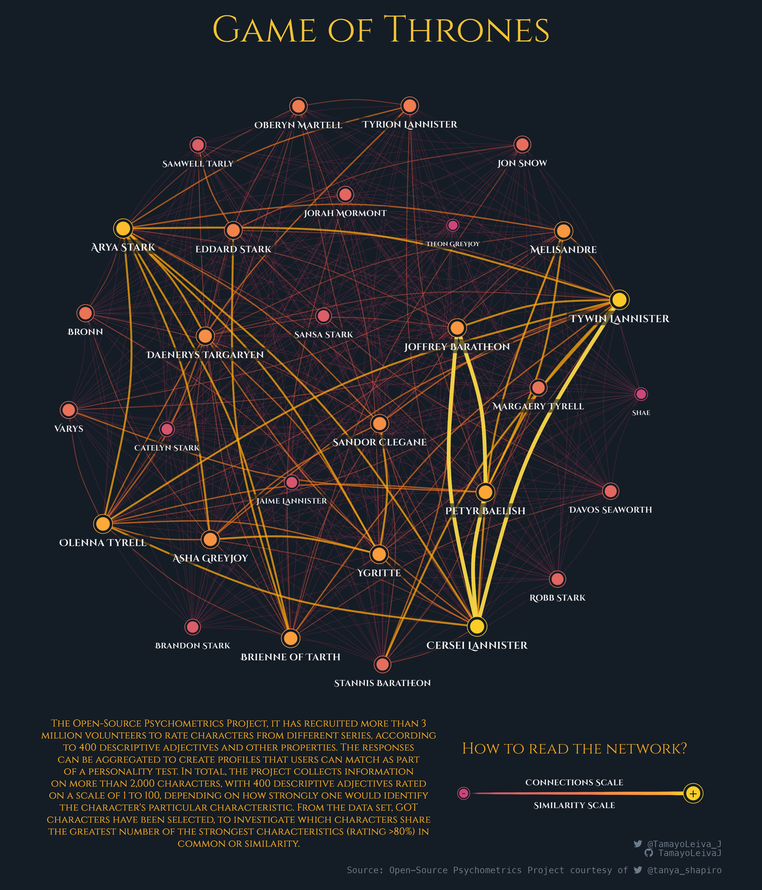
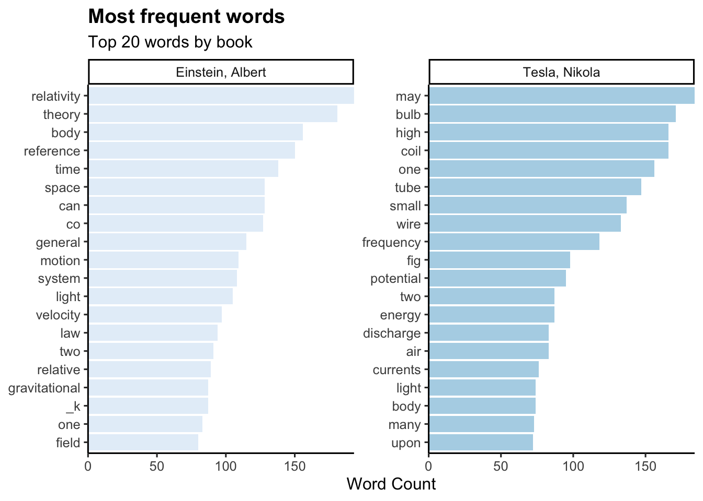
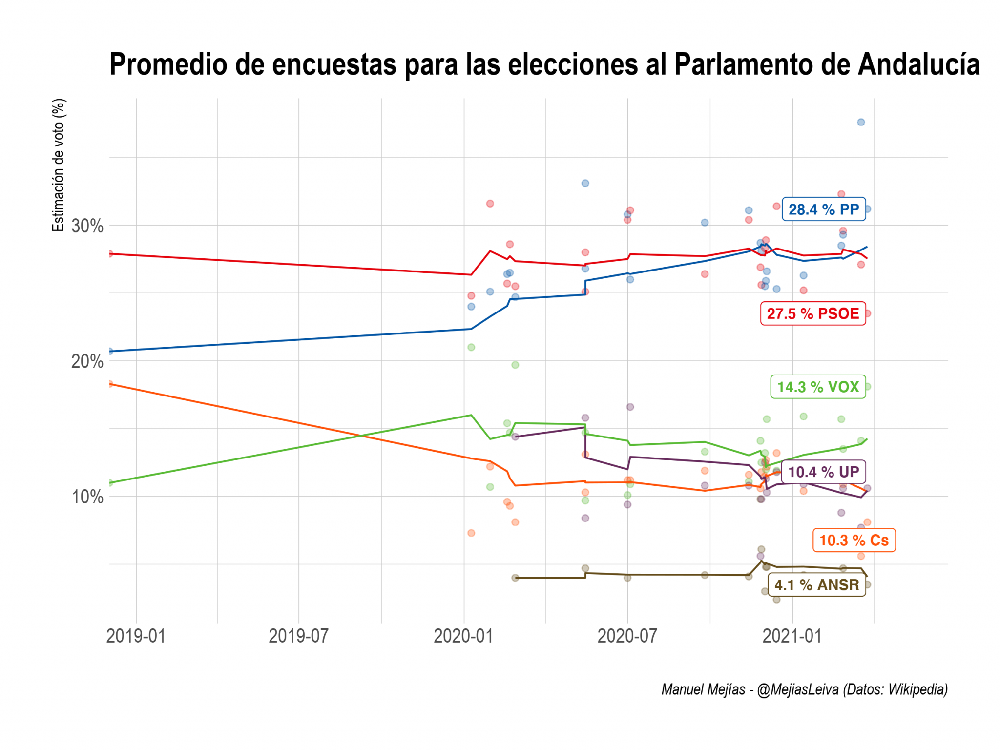
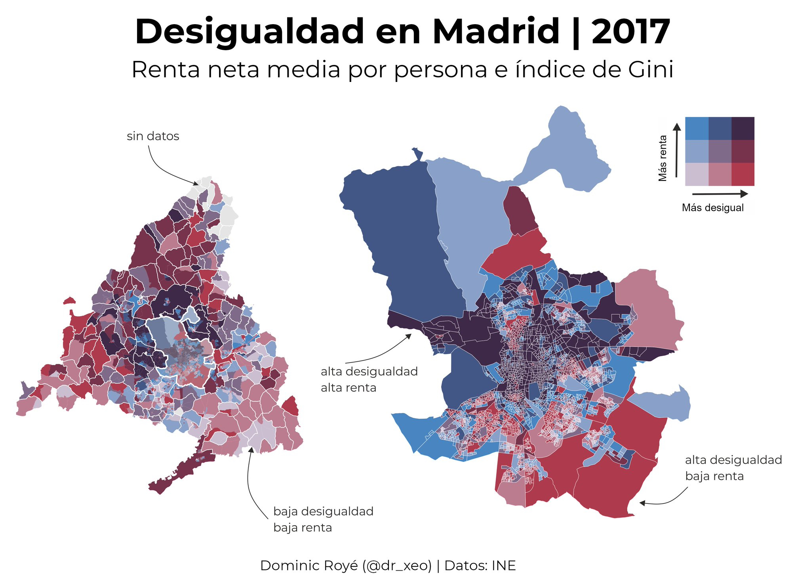
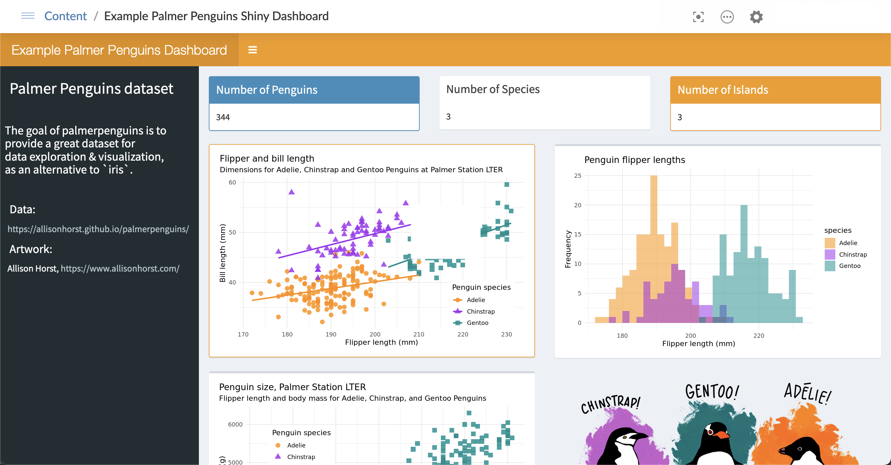
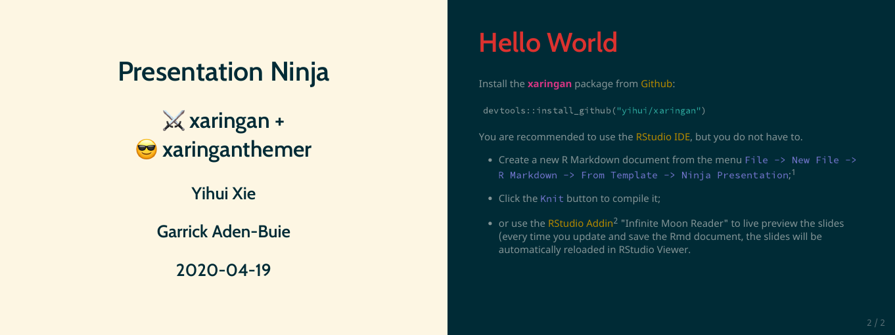
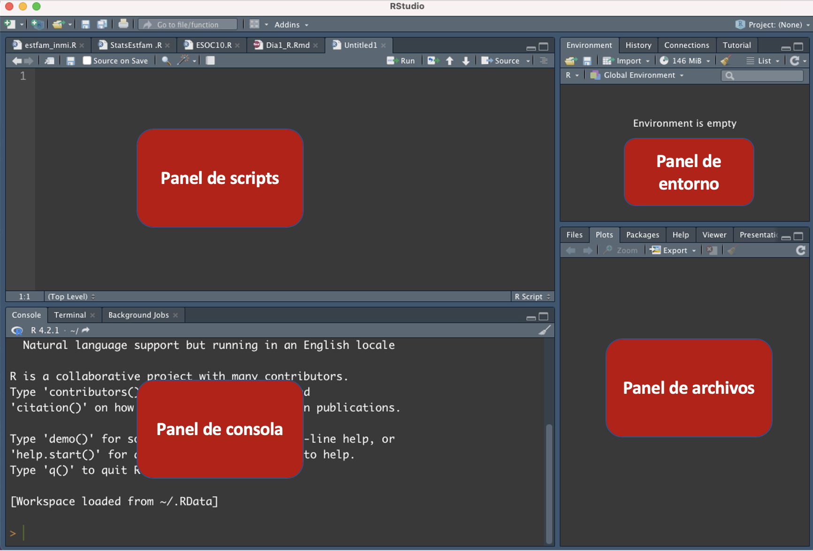

```{r xaringan-themer, include = FALSE}
library(xaringanthemer)
library(emo)
library(fontawesome)

style_duo_accent(primary_color = "#1F4257",
  secondary_color = "#EA9D8E", # #F97B64",
  background_color = "#FFFEFE",
  header_font_google = google_font("Josefin Sans"),
  text_font_google = google_font("Montserrat", "300", "300i", 
                                 "400", "500", "600", 
                                 "700", "800", "900"),
  code_font_google = google_font("Fira Mono"),
  black = "#1F4257",
  inverse_text_color = "#1F4257",
  inverse_header_color = "#1F4257",
  base_font_size = "21px",
  text_font_size = "1.1rem",
  code_font_size = "1rem",
  header_h1_font_size = "2.5rem",
  header_h2_font_size = "2.3rem",
  header_h3_font_size = "1.8rem",
  code_highlight_color = "rgba(248, 223, 88, 0.25)",
  code_inline_background_color = "rgba(248, 223, 88, 0.6)",
  code_inline_font_size = "1em",
  text_bold_font_weight = 800,
  link_decoration = "underline dotted",
  link_color = "#74688D",
  inverse_link_color = "#1F4257",
  colors = c(purple = "#74688D",
             yellow = "#F8DF58",
             green = "#2c8475",
             red = "#E54F4D",
             orange = "#EA9D8E",
             green_light = "rgba(44, 132, 117, 0.35)",
             red_light = "rgba(229, 79, 77, 0.7)",
             purple_light = "rgba(116, 104, 141, 0.5)"),
  extra_css = list(
    ".title-slide h1" = list(
      "font-size" = "52px",
      "line-height" = "1.1em"),
    ".title-slide h2" = list(
    "margin-top" = "-10px",
    "margin-bottom" = "40px"),
    ".heading h1" = list(
      "line-height" = "1.3em"
    ),
    ".title-slide h3" = list(
    "margin-top" = "40px.",
    "line-height" = "0.3em"),
    ".remark-slide-content" = list(
      "line-height" = "1.1em"),
    ".hljs-github .hljs" = list(
    "background" ="#grey40" ),
    ".inverse a" = list(
      "color"= "white !important"
    ),
    ".table.dataTable.display tbody tr.even" = list(
  "background-color" = "#grey40"),
  ".remark-slide thead, .remark-slide tfoot, .remark-slide tr:nth-child(even)" = list("background" = "#FFFFFF")
    )
  )
```

```{r setup, include=FALSE}
options(htmltools.dir.version = FALSE)
```

class: inverse, center, middle, heading

# Empezando con R y RStudio

---
# ¿Qué es R?
`R` es un **.bg-purple_light[lenguaje estadístico]**, creado por y para la estadística, con 4 ventajas fundamentales:

* **.bg-purple_light[Software libre]** (como C++, Python, etc). no solo es gratis, sino que permite **.bg-orange[acceder libremente a código ajeno]**.

* **.bg-purple_light[Lenguaje modular]**: al ser software libre, existen **.bg-orange[trozos de código]** hechos por otras personas (**.bg-yellow[paquetes]**) que podemos instalar según necesidades.

* **.bg-purple_light[Gran comunidad de usuarios]**: `R` tiene una comunidad de usuarios gigante para hacer estadística (Python tiene una comunidad más enfocada al Machine Learning), con más de 18 000 paquetes.

* **.bg-purple_light[Lenguaje de alto nivel]**. Los lenguajes de alto nivel, como `R` o `Python`, facilitan la programación al usuario (menor curva de aprendizaje, aunque más lentos en ejecución).

---
# ¿Por qué utilizar R?
&nbsp;
&nbsp;
&nbsp;

* ¡Es gratis! Si eres profesor/a o estudiante, las ventajas son evidentes.

* Funciona en diversas plataformas, como Windows, Unix y MacOS.

* Proporciona una plataforma inigualable para programar nuevos métodos estadísticos de forma fácil y directa.

* Contiene rutinas estadísticas avanzadas que aún no están disponibles en otros paquetes.

* Dispone de capacidades gráficas de última generación.

---
# Cosas que se pueden hacer con R

* Análisis de redes 
.center[

]
---
# Cosas que se pueden hacer con R

* Análisis de texto 
.center[

]
#### Imagen: Jan Kirenz
---
# Cosas que se pueden hacer con R

* Web scraping

.center[]

---
# Cosas que se pueden hacer con R

* Procesamiento y visualización de datos espaciales 
.center[

]
---
# Cosas que se pueden hacer con R

* Creación de aplicaciones interactivas 

.center[

]

#### Imagen: Isabella Velásquez
---
# Cosas que se pueden hacer con R

* Presentaciones, informes o artículos académicos

    * Esta misma presentación está hecha en R usando la librería `xaringanthemer`
.center[

]
---
# Descargar R y RStudio

Para comenzar a utilizar R, es necesario descargar e instalar tanto el lenguaje de programación como un entorno de desarrollo integrado como RStudio.

Descargar **R**:

*   <https://www.r-project.org/>

Descargar **RStudio**:

*   <https://www.rstudio.com/products/rstudio/download/>

Para instalar R / RStudio, vea este [**video**](https://www.youtube.com/watch?v=by5HyJX6H1I&ab_channel=thatRnerd).

---
# Estructura de RStudio
&nbsp;
&nbsp;
&nbsp;

RStudio es un entorno de desarrollo integrado que proporciona una interfaz gráfica de usuario para facilitar el uso de R. La interfaz de RStudio se divide en cuatro paneles principales:

*   El panel de **.bg-purple_light[scripts]**: donde se escribe y ejecuta el código de R.

*   El panel de **.bg-purple_light[consola]**: donde se muestra la salida del código que se ejecuta.

*   El panel de **.bg-purple_light[entorno]**: donde se pueden ver los objetos cargados en R y sus atributos.

*   El panel de **.bg-purple_light[archivos]**: donde se pueden ver los gráficos, archivos, etc.

---
# Estructura de RStudio

.center[

]

---
class: inverse, center, middle, heading

# Consejos generales

---
# Antes de empezar, consejos generales
&nbsp;
&nbsp;

* Empezar un script (`.R`)
  * Limpiar el espacio
  * Cargar paquetes que van a ser usados

```{r warning=FALSE, message=FALSE}
# Curso R - Sesión 1 ---------------------------------------------------------------

rm(list = ls()) # limpiar el espacio

library(tidyverse) # carga paquete tidyverse
library(janitor) # carga paquete janitor
```

- Nombrar objetos
  * 2Cs: Conciso y consistente
  * Minúscula
  * Estilos: `sexoEdad`, `sexo_edad` o `sexo.edad`    

---
# Antes de empezar, consejos generales
&nbsp;
&nbsp;

- Comentar `#` [`Ctrl` + `Mayús` + `C`]
  * Explicar el por qué
  * Usar separadores para organizar el scrip [`Ctrl` + `Mayús` + `R`]

```{r eva=FALSE, warning=FALSE, message=FALSE}
# Librerías ---------------------------------------------------------------
library(tidyverse)

# Directorio de trabajo ---------------------------------------------------


# Importar datos ----------------------------------------------------------

```

- Espacios  
  * Usar espacios en torno a los operadores
```{r spaces, eva=FALSE}
a<-22+23 # mal
a <- 22 + 23 # bien
```
---
# Help!
 - Ayuda con las funciones:  

```{r documentation, echo=T, eval=FALSE}
help(mean)
?mean
```    

Recursos de ayuda a la programación en R:    
&nbsp;
&nbsp;
&nbsp;

- [**Stackoverflow**](https://stackoverflow.com/)    

- [**ChatGPT**](https://chat.openai.com/)

- [**Cheatsheets**](https://www.rstudio.com/resources/cheatsheets/)    

- [**Quick**](https://www.statmethods.net/)

---
class: inverse, center, middle, heading

# Tipos de variables
---
## Tipos de variables
.pull-left[

- **Numérica continua**: son variables que pueden tomar cualquier valor dentro de un rango determinado.
  - Ejemplo: Ingreso mensual de los hogares.

- **Numérica discreta**: son variables que sólo pueden tomar valores enteros, es decir, números sin decimales.
  - Ejemplo: Número de hijos en una familia.

- **Categórica nominal**: son variables que describen una cualidad o categoría sin un orden o jerarquía específica.
  - Ejemplo: Género (masculino/femenino).
]

.pull-right[

- **Categórica ordinal**: son variables que describen una cualidad o categoría con un orden o jerarquía específica.
  - Ejemplo: Nivel socioeconómico (bajo/medio/alto).

- **Caracter**: son variables que representan cadenas de caracteres o textos.
  - Ejemplo: Respuestas abiertas en una encuesta.
]
---
class: inverse, center, middle, heading

# Primeras operaciones con datos
---
# Primeros pasos en R: calculadora

Usando R como una calculadora:

```{r echo=TRUE}
2 * 3
```

En R, los **objetos** o **variables** se definen usando el operador `<-`.

```{r echo=TRUE}
x <- 5
y <- x - 4
```

```{r}
y
```

Todas las instrucciones en R en las que crees objetos, es decir, las instrucciones de asignación, tienen la misma estructura:

*   nombre_objeto `<-` valor

---
# Vectores y data.frame

*   En R, un **vector** es una colección ordenada de elementos del mismo tipo. Estos pueden ser **numeric, integers, character, factors o logical**.

```{r, echo=TRUE}
numeric_vector <- c(1,2,3,4,5)
character_vector <- c("a", "b","c","d","e")
```

*   La mayoría de las veces trabajaremos con muchos vectores a la vez, reunidos en un **data frame** o un **tibble**.

```{r, echo=TRUE}
my_df <- data.frame(fruta = c("manzana", "pera", "uva"), 
                    precio = c(2.99, 1.99, 3.99))
```

*   No todo en R puede almacenarse en un marco de datos, a veces trabajarás con **lists**.
*   Funciones útiles para convertir vectores: `as.numeric()`, `as.character()`,`as.factor()`, etc. Trabajaremos con ellas más adelante.
---
# Seleccionando elementos de un data.frame

**.bg-purple_light[¿Cómo seleccionar y filtrar datos?]**

En el caso de los data.frame tenemos además a nuestro disposición una herramienta muy potente: la función `subset()`. 

```{r}
subset(my_df, subset = precio > 2,
       select = "fruta")
```
---
class: inverse, center, middle, heading

# Primeros ejercicios 📝
---
# Primeros ejercicios

* 📝 **Ejercicio 1**: añade debajo otra línea para definir una variable `b` con el valor `5`. Tras asignarles valores, multiplica los números en consola.

```{r}
a <- 2
```

---
# Primeros ejercicios

* 📝 **Ejercicio 1**: añade debajo otra línea para definir una variable `b` con el valor `5`. Tras asignarles valores, multiplica los números en consola.

```{r}
a <- 2
```

- Solución ej. 1:

```{r}
# Para poner comentarios en el código se usa #

# Definición de variables
a <- 2
b <- 5

# Multiplicación
a * b
```

---
# Primeros ejercicios

* 📝 **Ejercicio 2**: modifica el código inferior para definir dos variables `c` y `d`, con valores 3 y -1, y calcular la división `c/d`

```{r eval = FALSE}
c <- # deberías asignarle el valor 3
d <- # deberías asignarle el valor -1
```

---
# Primeros ejercicios

* 📝 **Ejercicio 2**: modifica el código inferior para definir dos variables `c` y `d`, con valores 3 y -1, y calcular la división `c/d`

```{r eval = FALSE}
c <- # deberías asignarle el valor 3
d <- # deberías asignarle el valor -1
```

* Solución ej. 2:

```{r}
# Definición de variables
c <- 3
d <- -1
# Operación (división)
c/d
```
---
# Primeros ejercicios

* 📝 **Ejercicio 3**: en este ejercicio, tenemos dos vectores: primer_vector, que contiene valores numéricos del 1 al 5, y segundo_vector, que contiene valores de caracteres "a" a "e". Utilizando la función `data.frame()`, creamos un nuevo dataframe llamado nuevo_df .

```{r}
primer_vector <- c(1,2,3,4,5)
segundo_vector <- c("a","b","c","d","e")
```

---
# Primeros ejercicios

* 📝 **Ejercicio 3**: en este ejercicio, tenemos dos vectores: primer_vector, que contiene valores numéricos del 1 al 5, y segundo_vector, que contiene valores de caracteres "a" a "e". Utilizando la función `data.frame()`, creamos un nuevo dataframe llamado nuevo_df .

```{r}
primer_vector <- c(1,2,3,4,5)
segundo_vector <- c("a","b","c","d","e")
```

- Solución ej. 3:

```{r}
nuevo_df <- data.frame(primer_vector,segundo_vector)
nuevo_df
```
---
# Primeros ejercicios

* 📝 **Ejercicio 4**: a partir del data.frame **.bg-purple_light[nuevo_df]**, selecciona las filas donde los valores en la columna primer_vector sean mayores que 3 utilizando la función `subset()` y asígnalo a un objeto llamado **.bg-purple_light[subset_df]**.

---
# Primeros ejercicios

* 📝 **Ejercicio 4**: a partir del data.frame **.bg-purple_light[nuevo_df]**, selecciona las filas donde los valores en la columna primer_vector sean mayores que 3 utilizando la función `subset()` y asígnalo a un objeto llamado **.bg-purple_light[subset_df]**.

- Solución ej. 4:

```{r}
subset_df <- subset(nuevo_df, primer_vector > 3)
subset_df
```
---
class: inverse, center, middle, heading

# Paquetes, librerías y datos

---
# Paquetes y librerías para importar datos
&nbsp;

.pull-left[

- **Paquete: haven**
    - Archivos: Stata, SPSS, SAS
    - Funciones:
        * `read_dta("tuarchivo.dta")`
        * `read_sav()`
        * `read_sas()`


- **Paquete: readr**
    - Archivos: csv
    - Funciones:
        * `read_csv("tuarchivo.csv")`
]

.pull-right[

- **Paquete: readxl**
    - Archivos: xls / xlsx
    - Funciones:
        * `read_xls("tuarchivo.xls")`
        * `read_xlsx("tuarchivo.xlsx")`
]       
---
# Paquetes y librerías para exportar datos
&nbsp;
&nbsp;
&nbsp;

Algunas funciones importantes en R para exportar datos:

* `write_excel()` se utiliza para exportar datos a un archivo de Excel (.xlsx).
* `write_sav()` se utiliza para exportar datos a un archivo de formato SPSS (.sav).
* `write_dta()` se utiliza para exportar datos a un archivo de formato Stata (.dta).

---
# Paquetes y librerías
&nbsp;
&nbsp;

Primero, instalar paquetes

  *  Un paquete en R es una colección de funciones, datos y documentación que se pueden usar para realizar tareas específicas.

```{r echo=TRUE}
# install.packages("tidyverse")
```

Segundo, cargar librerías

  * Las librerías son directorios en tu sistema de archivos donde se almacenan los paquetes instalados.

```{r}
library(tidyverse)
```

---
# Directorio de trabajo e importar datos

Antes de cargar los datos debemos de definir nuestro directorio de trabajo. Esto es, debemos indicarle a R cuál es la ubicación en tu ordenador donde se guardan y cargan los archivos de datos y scripts.

```{r echo=TRUE}
#setwd("~/Desktop/Intro-R/Dia1")
```

Para saber el directorio de trabajo actual en R, puedes utilizar la función `getwd()`. Por ejemplo:

```{r echo=TRUE}
getwd()
```

Una vez definido el directorio de trabajo, procedemos a importar los datos a R:

```{r echo=TRUE, message=FALSE, warning=FALSE}
data <- read_csv("GSOEP9402.csv")
```
---
# Cambiando la estructura del data frame
&nbsp;
&nbsp;
&nbsp;

Los comandos más comunes que pueden ayudar a modificar el formato de las columnas:

* `as.numeric()` cambiará su formato a numérico.

* `as.character()` cambiará su formato a carácter.

* `as.factor()` cambiará los datos como factores.

```{r echo=TRUE}
data$school <- as.factor(data$school)
data$income <- as.numeric(data$income)
```

---
# Conoce tus datos 🔎️ 

`head()` muestra las 6 primeras filas de sus datos.

Para ver más (o menos), puedes hacer `head(data, n)`.

```{r echo=TRUE}
head(data)
```

---
# Conoce tus datos 🔎️ 

`str()` te da una visión general de los tipos de datos.

```{r echo=TRUE}
str(data)
```
---
# Conoce tus datos 🔎️ 

`glimpse()` es útil para obtener una vista previa rápida de la estructura de un dataframe y el tipo de datos de sus variables.

```{r echo=TRUE}
glimpse(data)
```
---
# Conoce tus datos 🔎️ 

* La función `summary()` se utiliza para obtener un resumen estadístico de un objeto, como un vector, una matriz o un marco de datos. El resumen proporciona información como el mínimo, el primer cuartil, la mediana, el tercer cuartil y el máximo de los datos, así como el número de valores faltantes.

```{r echo=TRUE}
summary(data)
```
---
# Conoce tus datos 🔎️ 

`summary()` le proporciona estadísticas resumidas de sus datos. Puede aplicarlo a todo el data frame o **a una sola variable**.

```{r echo=TRUE}
summary(data$income)
```

```{r echo=TRUE}
summary(data$meducation)
```

&nbsp;

* El símbolo del dólar (`$`) se utiliza en la programación en R para **.bg-purple_light[seleccionar una columna de un data frame]**.

---
# Conoce tus datos 🔎️ 

* Contar los valores perdidos en cada columna

```{r echo=TRUE}
colSums(is.na(data))
```

---
# Conoce tus datos 🔎️ 

`table()` cuenta el número de veces que aparece cada categoría y muestra los resultados en una tabla.

```{r echo=TRUE}
table(data$school)
```

También es posible crear tablas que incluyan dos o más variables categóricas:

```{r echo=TRUE}
table(data$school,data$marital)
```

---
# Conoce tus datos 🔎️ 

```{r echo=TRUE, fig.align='center'}
hist(data$income)
```

---
# Conoce tus datos 🔎️ 

```{r, fig.align='center'}
boxplot(income ~ school, data = data,
        main = "Boxplot: itinerario educativo según ingresos del hogar")
```

---
# Conoce tus datos 🔎️ 

Calcular la media de ingresos para el conjunto de la muestra:

```{r echo=TRUE}
mean(data$income)
```

Mediana de ingresos para el conjunto de la muestra:

```{r echo=TRUE}
median(data$income)
```
---
# Conoce tus datos 🔎️ 

Encontrar el valor de renta del hogar más bajo del conjunto de datos: 
```{r echo=TRUE}
min(data$income)
```

Encontrar el valor de renta del hogar más alto del conjunto de datos: 
```{r echo=TRUE}
max(data$income)
```

---
# Conoce tus datos 🔎️ 

Para calcular la media por grupos se puede utilizar la función `aggregate`. Por ejemplo, vamos a calcular la media de años de educación de las madres agrupada por el itinerario educativo seguido por los hijos/as:

```{r echo=TRUE}
aggregate(meducation ~ school, data = data, mean)
```

---
# Conoce tus datos 🔎️ 

- Para analizar variables categóricas:

```{r echo=TRUE}
library(janitor)

tabyl(data$school)
```
---
# Conoce tus datos 🔎️ 

```{r echo=TRUE}
data %>% 
  tabyl(school,gender)
```

- Aquí hay un nuevo signo extraño: `%>%`. Esta cosa se llama **"pipe"**. Puedes leerlo como decirle a R: **"primero haz esto y luego haz aquello"**. Así, primero le dices a R que use el objeto "data" y luego (%>%) le dices a R que tome ese objeto y realice la operación tabyl() con ese objeto.

- También podéis encontrar este signo `|>` que es la última actualización del **pipe** en R.

---
# Conoce tus datos 🔎️ 

```{r echo=TRUE}
data %>% 
  tabyl(school,gender) %>%
  adorn_percentages("row") #<<
```
---
# Conoce tus datos 🔎️ 

```{r echo=TRUE}
data %>% 
  tabyl(school,gender) %>%
  adorn_percentages("row") %>% 
  adorn_pct_formatting(digits = 1) #<<
```

---
# Guardar script 💾
&nbsp;
&nbsp;
&nbsp;

* File >> Save As...

* Elige una ubicación en tu ordenador donde desees guardar el script.

* Asigna un nombre descriptivo al archivo. Por convención, los scripts de R suelen tener una extensión .bg-yellow[.R] al final del nombre del archivo (por ejemplo, .bg-orange[mi_script.R]).

---
class: inverse, center, middle, heading
# Recursos 📚
---
# Recursos para aprender 
&nbsp;
&nbsp;
&nbsp;

* Libros: [**R for Data Science**](https://r4ds.had.co.nz/)

* Cursos web: [**DataCamp**](https://www.datacamp.com/)

* Twitter: [**RLadiesGlobal**](https://twitter.com/RLadiesGlobal), [**hadleywickham**](https://twitter.com/hadleywickham), [**dataandme**](https://twitter.com/dataandme),
[**andrewheiss**](https://twitter.com/andrewheiss)

* Rbloggers: : [**https://www.r-bloggers.com/**](https://www.r-bloggers.com)
