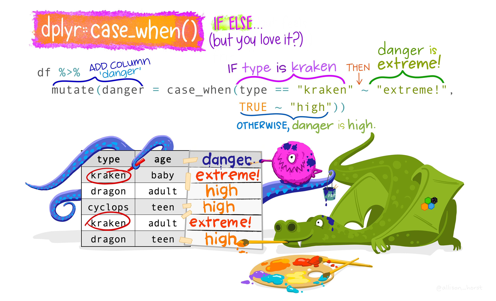

```{r xaringan-themer, include = FALSE}
library(xaringanthemer)
library(emo)
library(fontawesome)

style_duo_accent(primary_color = "#1F4257",
  secondary_color = "#EA9D8E", # #F97B64",
  background_color = "#FFFEFE",
  header_font_google = google_font("Josefin Sans"),
  text_font_google = google_font("Montserrat", "300", "300i", 
                                 "400", "500", "600", 
                                 "700", "800", "900"),
  code_font_google = google_font("Fira Mono"),
  black = "#1F4257",
  inverse_text_color = "#1F4257",
  inverse_header_color = "#1F4257",
  base_font_size = "21px",
  text_font_size = "1.1rem",
  code_font_size = "1rem",
  header_h1_font_size = "2.3rem",
  header_h2_font_size = "2rem",
  header_h3_font_size = "1.5rem",
  code_highlight_color = "rgba(248, 223, 88, 0.25)",
  code_inline_background_color = "rgba(248, 223, 88, 0.6)",
  code_inline_font_size = "1em",
  text_bold_font_weight = 800,
  link_decoration = "underline dotted",
  link_color = "#74688D",
  inverse_link_color = "#1F4257",
  colors = c(purple = "#74688D",
             yellow = "#F8DF58",
             green = "#2c8475",
             red = "#E54F4D",
             orange = "#EA9D8E",
             green_light = "rgba(44, 132, 117, 0.35)",
             red_light = "rgba(229, 79, 77, 0.7)",
             purple_light = "rgba(116, 104, 141, 0.5)"),
  extra_css = list(
    ".title-slide h1" = list(
      "font-size" = "52px",
      "line-height" = "1.1em"),
    ".title-slide h2" = list(
    "margin-top" = "-10px",
    "margin-bottom" = "40px"),
    ".heading h1" = list(
      "line-height" = "1.3em"
    ),
    ".title-slide h3" = list(
    "margin-top" = "40px.",
    "line-height" = "0.3em"),
    ".remark-slide-content" = list(
      "line-height" = "1.1em"),
    ".hljs-github .hljs" = list(
    "background" ="#grey40" ),
    ".inverse a" = list(
      "color"= "white !important"
    ),
    ".table.dataTable.display tbody tr.even" = list(
  "background-color" = "#grey40"),
  ".remark-slide thead, .remark-slide tfoot, .remark-slide tr:nth-child(even)" = list("background" = "#FFFFFF")
    )
  )
```

```{r setup, include=FALSE}
options(htmltools.dir.version = FALSE)
```

class: inverse, center, middle, heading

# Primeros pasos: cargar librerías, definir directorio de trabajo e importar datos

---
# Librerías y datos

Cargamos las librerías
```{r, warning=FALSE, message=FALSE}
library(tidyverse)
```

Definimos el directorio de trabajo
```{r}
setwd("~/Desktop/Intro-R/Dia2")
```

Importamos los datos
```{r}
ecv19 <- read_csv("ecv19.csv")
```

---
# ¿Qué aspecto tienen? 🔎

```{r}
glimpse(ecv19)
```
---
class: inverse, center, middle, heading

# El flujo de trabajo de la ciencia de datos 
---
# Procesamiento de datos

-   La gestión de datos suele ser la parte de cualquier proyecto de análisis de datos que requiere más tiempo.

-   El proceso de tratamiento de datos incluye su importación, ordenación y transformación.

-   La gestión de datos es la manipulación o combinación de conjuntos de datos con fines de análisis, y a menudo hay que aclarar y repetir este proceso a medida que cambia la comprensión de los datos y también cambian las necesidades de modelización y visualización.

<div style="display: flex; justify-content: center;">
  
</div>
#### Ilustración: R for Data Science
---
class: inverse, center, middle, heading

# Depurando, ordenando y resumiendo datos con {dplyr}

---
# Empecemos a limpiar datos 🧹

Estas son las cinco funciones clave de **dplyr** que permiten resolver la gran mayoría de los desafíos de manipulación de datos:

-   Filtrar o elegir las observaciones por sus valores (`filter()` --- del inglés filtrar).

-   Seleccionar las variables por sus nombres (`select()` --- del inglés seleccionar).

-   Crear nuevas variables con transformaciones de variables existentes (`mutate()` --- del inglés mutar o transformar).

-   Contraer muchos valores en un solo resumen (`summarise()` --- del inglés resumir).

-   Reordenar las filas (`arrange()` --- del inglés organizar).
---
# Antes de empezar, el pipe .orange[%>%]

`%>%` puede leerse como "*y a continuación*", y nos **.bg-purple_light[permite encadenar múltiples operaciones en nuestro código]**.

Así escribimos código más simple, legible y con menos repeticiones.
.pull-left[

```{r}
# Filtrar los datos
ecv_filtrado <- filter(ecv19, 
                renta_hogar > 100000)

# Contar número de hogares
conteo_hogares <- count(ecv_filtrado, 
                        tipo_hogar)

# Resultado final
conteo_hogares
```
]

.pull-right[

```{r}
ecv19 %>% 
  filter(renta_hogar > 100000) %>%
  count(tipo_hogar)
```
]
---
# .orange[FILTRAR] registros: filter()

<div style="display: flex; justify-content: center;">
  
</div>
##### Ilustración: Allison Horst

---
# .orange[FILTRAR] registros: filter()

Una de las **operaciones más comunes** es **.bg-purple_light[filtrar registros]** en base a alguna **.bg-purple_light[condición lógica]**: con `filter()` se seleccionarán solo individuos que cumplan ciertas condiciones.

```{r}
ecv19 %>% 
  filter(sexo == "Mujer")
```

---
# .orange[FILTRAR] registros: filter()

Comparadores habituales:

* `==, !=` igual/distinto que
* `>, <` mayor/menor que
* `>=, <=` mayor/menor o igual que
* `%in%` los valores pertenecen a un listado
* `!is.na()` los valores no son ausentes (mejor usar `drop_na()`)
* `between(variable, val1, val2)`: si los valores (normalmente continuos) están dentro de un rango.

```{r}
ecv19 %>%
  filter(renta_hogar > 10000)
```

---
# .orange[FILTRAR] registros: filter()

En el caso de utilizar `%in%` dentro de `filter()`, se busca que los valores de una columna estén presentes en un conjunto de valores especificados.

```{r}
ecv19 %>%
  filter(edad %in% c(25:45)) 
```

---
# .orange[FILTRAR] registros: filter()

El operador **!** se coloca delante de una condición lógica para negarla. Esto significa que se seleccionarán las filas que no cumplan con la condición negada.

```{r}
ecv19 %>%
  filter(regimen_vivienda != "En propiedad")
```
---
# .orange[FILTRAR] registros: filter()

Cuando es una variable continua el interés podría estar en comprobar si la variable toma valores **.bg-purple_light[dentro de un intervalo continuo]**.

```{r}
ecv19 %>%
  filter(between(edad, 25, 35))
```
---
# .orange[FILTRAR] registros: filter()

Operadores lógicos: `&` y `|` (o)

```{r}
ecv19 %>%
  filter(edad > 30 | edad < 50)
```

---
# .orange[FILTRAR] registros: filter()

Además, podemos crear un nuevo data frame a partir de las condiciones que le facilitemos a `filter()`. Por ejemplo:

```{r}
filtered1 <- ecv19 %>% 
  filter((sexo == "Hombre" & edad %in% c(30:50)) |
         (sexo == "Mujer" & edad %in% c(55:65)))
filtered1
```
---
# .orange[FILTRAR] datos ausentes

Podemos también **.bg-purple_light[filtrar los registros ausentes]** en alguna de sus variables con `drop_na()`. Si no especificamos, elimina todos los registros que tenga alguno de sus campos ausente.

```{r eval = FALSE}
ecv19 %>% drop_na()
```

Podemos indicarle que nos elimine filas con datos ausentes fijándonos solo en **.bg-purple_light[alguna variable particular]**.

```{r}
ecv19 %>% drop_na(sexo, edad, ingresos_anuales)
```

---
# .orange[FILTRAR] datos ausentes

`!is.na()` también se puede utilizar para filtrar un dataframe excluyendo los valores ausentes (NA) en una columna específica.

```{r}
ecv19 %>%
  filter(!is.na(nivel_educativo))
```
---
# .orange[FILTRAR] registros:  slice()

Normalmente filtraremos registros por alguna condición pero no siempre, a veces nos puede interesar, por ejemplo, sacar las primeras n filas. Pera podemos crear **.bg-purple_light[rebanadas de los datos]**, seleccionando filas por su posición con `slice()`.

```{r}
ecv19 %>% slice(1) 
```
---
# .orange[FILTRAR] registros:  slice()

Recuerda que también podemos **.bg-purple_light[extraer varias rebanadas]** a la vez.

```{r}
# filas de la 1 a la 5
ecv19 %>% slice(1:5)
```
---
# .orange[FILTRAR] registros:  slice()

También podríamos usar una **.bg-purple_light[secuencia de índices]** a extraer.

```{r}
# filas 1, 2, 10, 13, 27
ecv19 %>% slice(c(1, 2, 10, 13, 27))
```

---

# .orange[SELECCIONAR] columnas:  select()

Utilizamos `select()` para guardar sólo aquellas variables que nos interesan.

Podemos seleccionar por nombre de columna:

```{r}
ecv19 %>%
  select(sexo, renta_hogar)
```
---
# .orange[SELECCIONAR] columnas:  select()


Como sucedía al filtrar, la función `select()` es bastante versatil y nos permite:

* Seleccionar **.bg-purple_light[varias variables a la vez]** (concatenando sus nombres).

```{r}
ecv19 %>% 
  select(sexo:tipo_hogar)
```

---
# .orange[SELECCIONAR] columnas:  select()

Por posición:

```{r}
ecv19 %>%
  select(1:3)
```

---
# .orange[SELECCIONAR] columnas:  select()

Todas las columnas menos una:

```{r}
ecv19 %>%
  select(-ccaa)
```

---
# .orange[SELECCIONAR] columnas:  select()

E incluso quitar varias:

```{r}
ecv19 %>%
  select(-c(4:8))
```
---
# .orange[SELECCIONAR] columnas:  select()

* Seleccionar columnas que **.bg-purple_light[contengan]** un texto (`contains()`)

```{r}
tb <- tibble("edad" = c(30, 35, 40),
             "color_ojos" = c("azul", "amarillo", "negro"),
             "pelo_color" = c("negro", "marrón", "rubio"))

tb %>% 
  select(contains("color"))
```

---
# .orange[RECOLOCAR] columnas: relocate()

Para facilitar la **.bg-purple_light[recolocación]** tenemos una función para ello, `relocate()`,  indicándole en `.after` o `.before` detrás o delante de qué columnas queremos moverlas.

```{r}
ecv19 %>% 
  relocate(nivel_educativo, .before = ccaa)
```
---
# .orange[RENOMBRAR] columnas: rename()

A veces también podemos querer **modificar la «metainformación»** de los datos, **.bg-purple_light[renombrando columnas]**. Para ello usaremos la función `rename()` poniendo primero el nombre nuevo y luego el antiguo.

```{r}
ecv19 %>% 
  rename(genero = sexo, 
         estructura_familiar = tipo_hogar)
```
---
# .orange[MODIFICAR] columnas: mutate()

<div style="display: flex; justify-content: center;">
  
</div>
##### Ilustración: Allison Horst

---
# .orange[MODIFICAR] columnas: mutate()

En muchas ocasiones querremos **.bg-purple_light[modificar o crear  variables]**. Para ello tenemos la función `mutate()`. Vamos a crear una **nueva variable** `renta_equivalente` con la variable de renta divida entre las unidades de consumo de cada hogar (escala OCDE).

```{r}
ecv19 %>%
  mutate(renta_equivalente = renta_hogar/unidades_consumo)
```
---
# .orange[MODIFICAR] columnas: transmute()

Otra opción es **.bg-purple_light[quedarnos solo con las modificadas]** (por ejemplo, para ver si hace lo que debe) con `transmute()`

```{r}
ecv19 %>%
  transmute(renta_equivalente = renta_hogar/unidades_consumo)
```

---
# .orange[MODIFICAR] columnas: mutate()

También podemos combinarlo con la función `if_else()`, que nos puede ayudar a **.bg-purple_light[recategorizaciones sencillas]**.

-   `if_else` (condición, verdadero, falso) nos devuelve una columna con dos valores (V/F) en función de una condición:

```{r}
ecv19 %>%
  select(edad, renta_hogar, unidades_consumo) %>%
  mutate(renta_equiv = (renta_hogar/unidades_consumo),
         categoria_ingresos = if_else(renta_equiv <= 11500, "Bajos", "Resto"))
```
---
# .orange[MODIFICAR] columnas: mutate() + case_when()

Para **.bg-purple_light[recategorizaciones más complejas]** tenemos a nuestra disposición `case_when()`. Supongamos por ejemplo que queremos crear una **categoría en función de la edad**.

* Si `edad <= 35` –> serán `"35 años o menos"`.
* Si `edad %in% c(36:64)` –> serán `"36-64 años"`
* Si no se cumple lo anterior (`TRUE`) –> serán `"65 o más años"`

```{r}
ecv19 %>%
  select(edad) %>%
  mutate(edad_categoria = case_when(edad <= 35 ~ "35 o menos años",
                               edad %in% c(36:64) ~ "36-64 años",
                               TRUE ~ "65 o más años"))
```
---
# .orange[MODIFICAR] columnas: mutate() + case_when()
.center[

]

##### Ilustración: Allison Horst
---
# .orange[MODIFICAR] columnas: mutate() + case_when()

Las condiciones de `case_when()` pueden combinar varias variables, cómo por ejemplo:

* Si tiene menos de 30 años e ingresa menos de 6000 euros --> `"Joven precario"`
* Si tiene entre 40 y 55 años e ingresa más de 40000 euros --> `"Adulto acomodado"`
* En caso contrario --> `"Otros"`

```{r}
ecv19 %>%
  select(edad,ingresos_anuales) %>%
  mutate(edad_ingresos =
           case_when(edad < 30 & ingresos_anuales < 6000 ~ "Joven precario",
                  edad %in% c(40:55) & ingresos_anuales > 40000 ~ "Adulto acomodado",
                  TRUE ~ "Otros"))
```
---
# .orange[RESUMIR]: group_by() + summarise()

`group_by()` se utiliza para agrupar un conjunto de datos según una o varias variables.

Una vez has agrupado, puedes utilizar `summarise()` si quieres "resumirlas".

RECUERDA hacer `ungroup()` si quieres volver a trabajar con los datos sin agrupar.

```{r}
ecv19 %>%
  group_by(sexo) %>%
  summarise(media_ingresos = mean(ingresos_anuales, na.rm = TRUE))
```
---
# .orange[RESUMIR]: group_by() + summarise()

Si observamos la base de datos original, podemos observar que tenemos una variable llamada **pesos**. Esta variable es muy común encontrarla en multitud de encuestas y es MUY IMPORTANTE saber usarla cuando realizamos nuestras estimaciones e inferencias.

Si queremos aplicar los pesos poblacionales podemos usar la función `weighted.mean()`:

```{r}
ecv19 %>%
  group_by(sexo) %>%
  summarise(media_ingresos_weighted = weighted.mean(ingresos_anuales, 
                                                    w = pesos, #<< 
                                                    na.rm = TRUE))
```

---
# .orange[REORDENAR] filas: arrange()

`arrange()` ordena las observaciones en función de una o más variables. Pasándole las variables que usaremos para la ordenación (por defecto de menor a mayor), podemos invertirlo usando `desc()`.

```{r}
ecv19 %>% arrange(sexo, desc(edad))
```
---
class: inverse, center, middle, heading

# Bonus track: transformando la estructura de los datos con {pivot_longer} y {pivot_wider} 🔧
---
# Datos .orange[SUCIOS]: messy data

Por ejemplo, vamos a cargar la tabla `table4a` del paquete `{tidyr}` (que ya lo tenemos cargado del entorno `{tidyverse}`).

```{r echo = FALSE}
library(tidyverse)
```

```{r}
table4a
```

**.bg-purple_light[¿Qué falla?]**

---
# Datos .orange[SUCIOS]: messy data

.pull-left[

```{r echo = FALSE}
library(tidyverse)
```

```{r}
table4a
```

**.bg-purple_light[¿Qué falla?]**

]

.pull-right[


❎ Cada **.bg-green_light[variable en una columna]**.

❎ Cada **.bg-orange[observación/individuo en una fila]** diferente.

❎ Cada **.bg-green_light[celda con un único valor]**.

]

Aunque la columna `$country` representa una variable, las otras columnas no: **.bg-purple_light[ambas son la misma variable]**, solo que medida en años distintos (que debería ser a su vez otra variable), de forma que **.bg-purple_light[cada fila está representando dos observaciones]** (1999, 2000).
---
# Datos .orange[SUCIOS]: messy data


.pull-left[

Lo que haremos será incluir una nueva columna llamada (por ejemplo) `year` que nos marque el año y otra llamada `cases` que nos diga el valor de la variable de interés en cada uno de esos años.

]

.pull-right[

```{r echo = FALSE,  out.width = "85%", fig.align = "center"}
knitr::include_graphics("pivot_longer.png")
``` 


]

---
# Datos .orange[SUCIOS]: messy data

Lo que haremos será incluir una nueva columna llamada (por ejemplo) `year` que nos marque el año y otra llamada `cases` que nos diga el valor de la variable de interés en cada uno de esos años.

Con la función `pivot_longer()` pivotaremos la tabla para pasarla a **formato long**:

```{r}
table4a %>%
  pivot_longer(cols = c("1999", "2000"), names_to = "year", values_to = "cases") #<<
```
---
# Datos .orange[SUCIOS]: messy data

```{r}
table4a %>%
  pivot_longer(cols = c("1999", "2000"),
               names_to = "year", 
               values_to = "cases") 
```

* `cols`: el **.bg-purple_light[nombre de las columnas a pivotar]** (con comillas por ser números y no caracteres).
* `names_to`: el **.bg-purple_light[nombre de la nueva columna]** a la que mandamos los **.bg-purple_light[nombres]** de las columnas.
* `values_to`: el **.bg-purple_light[nombre de la nueva columna]** a la que vamos a mandar los **.bg-purple_light[datos]**.

---
# Datos .orange[SUCIOS]: messy data

Veamos un segundo tipo de dato sucio: vamos a cargar la tabla `table2` del paquete `{tidyr}` (que ya lo tenemos cargado del entorno `{tidyverse}`). **.bg-purple_light[¿Qué falla?]**

```{r}
table2
```

---
# Datos .orange[SUCIOS]: messy data

.pull-left[


```{r}
head(table2)
```

]

.pull-right[


```{r echo = FALSE,  out.width = "110%", fig.align = "center"}
knitr::include_graphics("pivot_wider.png")
``` 
]


❎ Cada **.bg-orange[observación/individuo en una fila]** diferente.


Fíjate en las cuatro primeras filas: los registros con el mismo año deberían ser el mismo, es la misma información, **.bg-purple_light[debería estar en la misma fila]**, pero está dividada en dos. 

---
# Datos .orange[SUCIOS]: messy data

Lo que haremos será lo opuesto a antes: con `pivot_wider()` «ampliaremos» la **.bg-purple_light[tabla a lo ancho]**, con menos filas pero con más columnas.

```{r}
table2 %>%
  pivot_wider(names_from = type, values_from = count) #<<
```

* `names_from`: el **.bg-purple_light[nombre de la columna original]** de la que vamos a sacar las **.bg-purple_light[nuevas columnas]** que vamos a crear (`cases` y `population`).
* `values_from`: el **.bg-purple_light[nombre de la columna original]** de la que vamos a sacar los **.bg-purple_light[datos]**.

---
# Otras funciones útiles de dplyr

-   `distinct()` para seleccionar filas únicas de un marco de datos.

-   `top_n()` para filtrar las n observaciones principales (se puede utilizar en combinación con `arrange()`).

-   `ntile()` clasifica los valores en el número de grupos que proporcione. Útil para crear deciles, percentiles o cuartiles.

-   Todas las funciones: <https://dplyr.tidyverse.org/reference/index.html>\
