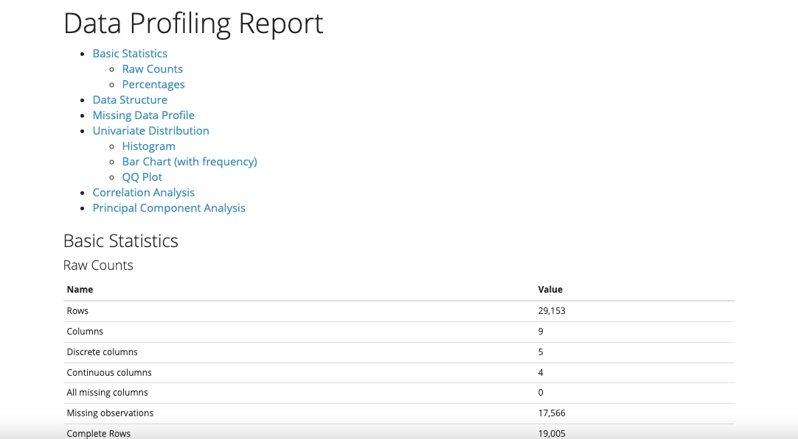

```{r xaringan-themer, include = FALSE}
library(xaringanthemer)
library(emo)
library(fontawesome)

style_duo_accent(primary_color = "#1F4257",
  secondary_color = "#EA9D8E", # #F97B64",
  background_color = "#FFFEFE",
  header_font_google = google_font("Josefin Sans"),
  text_font_google = google_font("Montserrat", "300", "300i", 
                                 "400", "500", "600", 
                                 "700", "800", "900"),
  code_font_google = google_font("Fira Mono"),
  black = "#1F4257",
  inverse_text_color = "#1F4257",
  inverse_header_color = "#1F4257",
  base_font_size = "21px",
  text_font_size = "1rem",
  code_font_size = "0.7rem",
  header_h1_font_size = "2rem",
  header_h2_font_size = "1.8rem",
  header_h3_font_size = "1.6rem",
  code_highlight_color = "rgba(248, 223, 88, 0.25)",
  code_inline_background_color = "rgba(248, 223, 88, 0.6)",
  code_inline_font_size = "1em",
  text_bold_font_weight = 800,
  link_decoration = "underline dotted",
  link_color = "#74688D",
  inverse_link_color = "#1F4257",
  colors = c(purple = "#74688D",
             yellow = "#F8DF58",
             green = "#2c8475",
             red = "#E54F4D",
             orange = "#EA9D8E",
             green_light = "rgba(44, 132, 117, 0.35)",
             red_light = "rgba(229, 79, 77, 0.7)",
             purple_light = "rgba(116, 104, 141, 0.5)"),
  extra_css = list(
    ".title-slide h1" = list(
      "font-size" = "52px",
      "line-height" = "1.1em"),
    ".title-slide h2" = list(
    "margin-top" = "-10px",
    "margin-bottom" = "40px"),
    ".heading h1" = list(
      "line-height" = "1.3em"
    ),
    ".title-slide h3" = list(
    "margin-top" = "40px.",
    "line-height" = "0.3em"),
    ".remark-slide-content" = list(
      "line-height" = "1.1em"),
    ".hljs-github .hljs" = list(
    "background" ="#grey40" ),
    ".inverse a" = list(
      "color"= "white !important"
    ),
    ".table.dataTable.display tbody tr.even" = list(
  "background-color" = "#grey40"),
  ".remark-slide thead, .remark-slide tfoot, .remark-slide tr:nth-child(even)" = list("background" = "#FFFFFF")
    )
  )
```

```{r setup, include=FALSE}
options(htmltools.dir.version = FALSE)
```

class: inverse, center, middle, heading

# Primeros pasos: librerías, directorio de trabajo y datos 
---
# Antes de comenzar...

Primero, cargamos las librerías necesarias para el análisis: 

```{r, message=FALSE, warning=FALSE}
library(tidyverse)
```

Segundo, definimos el directorio de trabajo en el que trabajaremos:
```{r}
# setwd()
```

Tercero, importamos el fichero de datos que está en formato csv:

```{r echo=TRUE, message=FALSE, warning=FALSE}
df <- read_csv("egd.csv")
```
---
# Antes de comenzar...

```{r echo=TRUE, message=FALSE, warning=FALSE}
glimpse(df)
```
---

class: inverse, center, middle, heading
# Exploratory Data Analysis (EDA)

---
# Exploratory Data Analysis (EDA)

* `DataExplorer` permite crear un resumen estadístico muy completo de las variables.

```{r eval=FALSE, message=FALSE, warning=FALSE}
library(DataExplorer)
create_report(df)
```

```{r echo = FALSE,  out.width = "70%", fig.align = "center"}

``` 
---
# Exploratory Data Analysis (EDA)
.pull-left[
* Histograma de la variable de respuesta

```{r eval=FALSE, message=FALSE, warning=FALSE}
df %>%
  ggplot(aes(mates_score)) +
  geom_histogram() +
  theme_bw(base_size = 15)
```
]
.pull-right[

```{r echo=FALSE, message=FALSE, warning=FALSE}
df %>%
  ggplot(aes(mates_score)) +
  geom_histogram() +
  theme_bw(base_size = 15)
```
]
---

# Exploratory Data Analysis (EDA)
.pull-left[
* Histograma de la variable predictora

```{r eval=FALSE, message=FALSE, warning=FALSE}
df %>%
  ggplot(aes(isec)) +
  geom_histogram() +
  theme_bw(base_size = 15)
```
]
.pull-right[

```{r echo=FALSE, message=FALSE, warning=FALSE}
df %>%
  ggplot(aes(isec)) +
  geom_histogram() +
  theme_bw(base_size = 15)
```
]
---

# Exploratory Data Analysis (EDA)
.pull-left[
* Gráfico de dispersión: puntuación matemáticas e índice de estatus socioeconómico

```{r eval=FALSE, message=FALSE, warning=FALSE, out.width = '420px', fig.align='center'}
df %>%
  ggplot(aes(x = isec, y = mates_score)) +
  geom_point() +
  geom_smooth(method = "lm") +
  theme_bw(base_size = 15)
```
]
.pull-right[
```{r echo=FALSE, message=FALSE, warning=FALSE}
df %>%
  ggplot(aes(x = isec, y = mates_score)) +
  geom_point() +
  geom_smooth(method = "lm") +
  theme_bw(base_size = 15)
```
]

---
class: inverse, center, middle, heading

# Regresión lineal simple: lm()
---
# Regresión lineal simple: lm()

* La regresión lineal se usa para **predecir el valor de una variable Y en función de una o más variables de predicción de entrada X**. Por consiguiente, nos sirve para responder preguntas como….

  - ¿Cuál será el precio de la gasolina mañana en España?
  
  - ¿Cuánto se gastarán las familias españolas estas navidades?
  
  - ¿Cuál es el número de votos de un partido “p” en las próximas elecciones generales?

* Objetivos

  - **.bg-purple_light[PREDECIR]** los valores que adoptará la variable dependiente (VD) a partir de valores conocidos del conjunto de variables independientes (VIs). Para ello, buscaremos la ecuación que mejor represente la asociación lineal existente entre las variables incluidas en el análisis.
  
  - **.bg-purple_light[CUANTIFICAR]** la relación de dependencia mediante el coeficiente de determinación, que informa de la proporción de varianza de la VD que queda explicada por la suma de VIs.
  
  - **.bg-purple_light[DETERMINAR EL GRADO DE CONFIANZA]** con que se puede afirmar que la relación observada en los datos muestras se da en la población.

---
# Regresión lineal simple: lm()

* Regresión lineal con una sola variable numérica:

```{r}
model1 <- lm(mates_score ~ isec, data = df)
summary(model1)
```
---
# Regresión lineal simple: lm()
La regresión lineal puede representarse formalmente de la siguiente manera:

```{r}
library(equatiomatic)

model1 %>%
  extract_eq(use_coef=FALSE, wrap = TRUE, terms_per_line=1)
```
---
# Regresión lineal simple: lm()

* usando `report()` para ayudarnos a interpretar el modelo

```{r}
library(report)
report(model1)
```
---
# Regresión lineal simple: lm()
**.bg-purple_light[¿Cómo podemos interpretar el modelo?]**

La fórmula del modelo 1 indica que estamos tratando de predecir la puntuación en matemáticas basada en el índice socioeconómico. Podemos interpretar los coeficientes del modelo de la siguiente manera:

- El **coeficiente** asociado a isec es de 30.3868. Esto indica que por cada aumento de una desviación estándar en el índice socioeconómico, se espera un aumento promedio de 30.3868 en la puntuación en matemáticas. Esto sugiere que hay una relación positiva entre el índice socioeconómico y la puntuación en matemáticas, donde los estudiantes con índices socioeconómicos más altos tienden a obtener mejores resultados en matemáticas en comparación con aquellos con índices socioeconómicos más bajos.

- El **valor p** asociado al coeficiente de isec también es muy pequeño (<2e-16), lo que indica que hay evidencia estadística sólida de una relación significativa entre el índice socioeconómico y la puntuación en matemáticas.

- En este caso, el **R-cuadrado** es 0.1177, lo que significa que aproximadamente el 11.77% de la variabilidad en la puntuación en matemáticas puede explicarse por el índice socioeconómico en este modelo. Esto indica que el índice socioeconómico es solo uno de los muchos factores que influyen en la puntuación en matemáticas, y hay otros factores que también deben tenerse en cuenta.
---
# Regresión lineal simple: lm()
Parametros a considerar para interpretar el modelo:

- **Coeficiente de Determinación R2**: El coeficiente de determinación explica cuánta varianza de la variable dependiente y podemos explicar con nuestro modelo. Su valor puede oscilar entre 0 y 1, y cuanto mayor sea su valor, más preciso será el modelo de regresión.

- Los **coeficientes** indican la contribución de cada variable independiente al modelo de regresión. El valor del coeficiente indica que, en promedio, un incremento de una unidad en la variable Xi, produce un incremento de βi en la variable dependiente.

- La evaluación de la **significatividad de los coeficientes (βi)** comienza con la definición de hipótesis sobre los valores de los parámetros poblaciones:

    - Hipótesis nula: H0; Bi=0 (el valor de un determinado coeficiente en la población es 0)
    - Hipótesis alternativa: H1; Bi≠0 (el valor de un determinado coeficiente en la población es distinto de 0). Esta es la hipótesis que esperamos corroborar en nuestros análisis

- El **contraste de hipótesis** siempre se realiza a un nivel de significación que el investigador escoge. El mínimo más recurrente es **valor p=0.05**, que supone una probabilidad de acierto del 95 por ciento (o de 5 por ciento de equivocarse al rechazar la H0 cuando es cierta).

---
# Regresión lineal simple: lm()

* Regresión lineal con una variable factor (o categórica):

```{r}
model2 <- lm(mates_score ~ sexo, data = df)
summary(model2)
```
---
# Regresión lineal simple: lm()

* Regresión lineal con una variable factor (o categórica):

Usando `relevel()` para elegir la categoría de referencia de la variable factor:

```{r }
df$sexo <- as.factor(df$sexo)
df$sexo <- relevel(df$sexo, ref = "Chico")
```

```{r}
model2 <- lm(mates_score ~ sexo, data = df)
summary(model2)
```
---
# Regresión lineal simple: lm()

* usando `report()` para ayudarnos a interpretar el modelo

```{r}
report(model2)
```
---
class: inverse, center, middle, heading
# Visualizando los valores pronosticados: lm simple
---
# Visualizando los valores pronosticados: lm simple
Una manera rápida de presentar los resultados de la regresión es representar gráficamente los coeficientes.
.pull-left[

```{r eval=FALSE, message=FALSE, warning=FALSE}
library(sjPlot)

plot_model(model1, type="eff")
```
]
.pull-right[

```{r echo=FALSE, message=FALSE, warning=FALSE, out.width="430px"}
library(sjPlot)

plot_model(model1, type="eff")
```
]

---

# Visualizando los valores pronosticados: lm simple
Una manera rápida de presentar los resultados de la regresión es representar gráficamente los coeficientes.
.pull-left[

```{r eval=FALSE, message=FALSE, warning=FALSE}
plot_model(model2, type="eff")
```
]
.pull-right[

```{r echo=FALSE, message=FALSE, warning=FALSE, out.width="430px"}
plot_model(model2, type="eff")
```
]
---
class: inverse, center, middle, heading

# Regresión lineal multivariante
---
# Regresión lineal multivariante
Llamamos regresión lineal múltiple (o multivariante) al análisis de regresión que incluye más de una variable independiente.

```{r}
model3 <- lm(mates_score ~ sexo + anos_educ_infantil + isec, data = df)
summary(model3)
```

---
# Regresión lineal multivariante
```{r}
report(model3)
```
---
# Regresión lineal multivariante
Interpretando el modelo de regresión lineal multivariante

* En regresión lineal multivariante, los coeficientes de regresión representan el cambio medio en la VD para una unidad de cambio en la VI **mientras se mantienen constantes los otros predictores en el modelo**. Este control estadístico que proporciona la regresión es muy importante, porque aisla el papel de una variable de todas las otras del modelo.

```{r}
summary(model3)
```
---
class: inverse, center, middle, heading
# Visualizando los valores pronosticados: lm multivariante
---
# Visualizando los valores pronosticados: lm multivariante

`plot_model` muestra los coeficientes asociados a cada variable (y sus categorías), y permite visualizar información como el grado de significatividad. 

.pull-left[

```{r eval=FALSE}
plot_model(model3,   
           show.values = TRUE,
           vline.color = "red")
```
]
.pull-right[

```{r echo=FALSE}
plot_model(model3,   
           show.values = TRUE,
           vline.color = "red")
```
]

---
# Errores estándar robustos

¿Qué pasa con los **errores estándar robustos o agrupados**? Hay *muchas* formas de obtenerlos en R. Sin embargo, mi forma preferida actualmente es utilizar el paquete `estimatr`.

```{r}
library(estimatr)

model_robust <- lm_robust(mates_score ~ isec, data = df, 
                          se_type = "HC1") #calcula los errores estandar robustos
summary(model_robust)
```

---
# Otros temas: términos de interacción
Podemos estar interesados en conocer el **efecto moderador** de una tercera variable en la relación entre el índice de estatus socioeconómico y la puntuación en matemáticas.

```{r}
model_interaction <- lm(mates_score ~ isec*repite_curso, data = df)
summary(model_interaction)
```

---
# Visualizando los valores pronosticados: interacción
Es recomendable visualizar la interacción porque **facilita su interpretación**. Los coeficientes asociados a los términos de interacción son, por lo general, bastantes complejos de entender a simple vista.
.pull-left[

```{r eval=FALSE, message=FALSE, warning=FALSE}
plot_model(model_interaction, 
           type = "eff", 
           terms = c("isec", "repite_curso"))
```
]
.pull-right[

```{r echo=FALSE, message=FALSE, warning=FALSE}
plot_model(model_interaction, 
           type = "eff", 
           terms = c("isec", "repite_curso"))
```
]
---

# ⚠️ Supuestos de la regresión lineal

<br>El ajuste y análisis del modelo de regresión lineal se sustenta en varias suposiciones basicas. Debemos comprobar que estas hipótesis se cumplen, al menos aproximadamente:

- La relación entre las variables x e y es lineal (una recta)

- La varianza de los errores es constante (heterocesdasticidad)

- Los errores tienen distribucion normal

- Ausencia de multicolinealidad perfecta

- La media de los residuos es igual a cero

- Los errores son independientes<br>


```{r message=FALSE, warning=FALSE, out.width = '420px', fig.align='center'}
library(performance)

# check_model(model1)
```

---
class: inverse, center, middle, heading

# Regresión logística: glm()

---
# Regresión logística: glm()
&nbsp;
&nbsp;

El análisis de regresión logística es una técnica para el análisis de **variables dependientes categóricas**, con dos categorías (dicotómicas) o más (polinómicas). Sirve para modelar la probabilidad de ocurrencia de un evento como función de otros factores, y responder preguntas como:

- ¿Qué factores explican la victoria/derrota de un candidato en unas elecciones?

- ¿Qué variables determinan que una persona fume?

- ¿Qué factores incrementan/disminuyen el riesgo de desempleo?

- ¿Cómo podemos explicar el abandono escolar?

- ¿Qué factores afectan a la probabilidad de tener un/otro hijo?
---
# Regresión logística: glm()
&nbsp;
&nbsp;

El modelo de regresión lineal no es válido cuando la variable respuesta no es normal, por ejemplo: respuestas si/no, conteos, probabilidades, etc.

Al igual que la regresión lineal, la regresión logística busca:

- **Predecir/explicar** una VD a partir de una o mas VI.

- Medir el grado de relación de la VD con las VI.

- Comprobar su significatividad.

A diferencia de la regresión lineal:

- La función que vincula a las VI con la VD no es lineal, sino logística.

- Los coeficientes de regresión se estiman por el procedimiento de Máxima Verosimilitud, buscando maximizar la probabilidad de ocurrencia del evento que se analiza.

---
# Regresión logística: glm()
&nbsp;
&nbsp;

Compartidos con la Regresión Lineal:

- Tamaño muestral elevado.
- Introducción de VI relevantes.
- Variables predictoras continuas o dicotómicas.
- Ausencia de colinealidad entre las VI
- Aditividad


Específicos:

- No-linealidad: La función de vinculación logit es no-lineal. Esto implica que el cambio en la VD producido por el incremento de una unidad en la VI depende del valor que dicha variable tenga. Es menos importante en los extremos de las VI, y mas importante en los valores centrales.
---
# Regresión logística: glm()
&nbsp;

* la variable dependiente en la regresión logística tiene que ser **factor**.

```{r}
df <- df %>% 
  mutate(repite_curso = if_else(repite_curso == "Repite", 1, 0), #1=repite;0=no repite
         repite_curso = as.factor(repite_curso),
         sexo = as.factor(sexo),
         estudios_madre = as.factor(estudios_madre)) #la consideramos como factor
```

* Podemos emplear la función `class()` para asegurarnos de que es factor:

```{r}
class(df$repite_curso)
```

* Establecemos las **categorías de referencia** para las variables con `relevel`. Esto se suele elegir de acuerdo con la literatura sobre el tema de estudio o a criterio del investigador/a.

```{r}
df$sexo <- relevel(df$sexo, ref = "Chico")
df$estudios_madre <- relevel(df$estudios_madre, ref = "Universitarios superiores")
```

---
# Regresión logística: glm()

* Definimos el modelo de regresión con la función `glm()`

```{r}
model1_glm <- glm(repite_curso ~ sexo + estudios_madre,
                  data = df, family = binomial("logit"))
summary(model1_glm)
```
---
# Regresión logística: glm()
La regresión logística puede representarse formalmente de la siguiente manera:

```{r, message=FALSE, warning=FALSE}
model1_glm %>% 
  extract_eq(use_coef=FALSE, wrap = TRUE, terms_per_line=1)
```

---
# Regresión logística: glm()

```{r, message=FALSE, warning=FALSE}
report(model1_glm)
```
---
# Regresión logística: glm()

Los estimadores representan el logaritmo del cociente de probabilidades. Por ejemplo:

- el coeficiente para "sexoChica" es -0.43532, lo que significa que ser chica en lugar de chico se asocia con una disminución de la probabilidad de repetir el curso.

Esta interpretación de los coeficientes es muy poco intuitiva. Tenemos varias alternativas: expresar los coeficientes como **odds ratio**, calcular las **probabilidades predichas** o calcular los **efectos marginales**. Principalmente, veremos las dos últimas.

* Por ejemplo, los Odds Ratio se pueden calcular de la siguiente manera:

```{r message=FALSE, warning=FALSE}
exp(cbind(OR = coef(model1_glm), confint(model1_glm)))
```

---
class: inverse, center, middle, heading
# Visualizando los valores pronosticados: glm
---
# Visualizando los valores pronosticados: plot_model

.pull-left[
* Calculamos con `plot_model` las **probabilidades predichas** de repetir curso según el nivel educativo de la madre
```{r eval=FALSE, message=FALSE, warning=FALSE}
plot_model(model1_glm, 
           type = "pred", 
           terms = c("estudios_madre")) +
  coord_flip() # gira los ejes del gráfico
```
]

.pull-right[

```{r echo=FALSE, message=FALSE, warning=FALSE, out.width="480px"}
plot_model(model1_glm, 
           type = "pred", 
           terms = c("estudios_madre")) +
  coord_flip() # sirve para girar los ejes del gráfico
```
]
---
# Visualizando los valores pronosticados: ggeffects

* `ggeffects` nos devuelve los valores en un dataframe que podemos combinar fácilmente con ggplot para la visualización de los resultados de una manera más estilizada:

* Cargamos la librería y llamamos a `ggpredict()`:

```{r}
library(ggeffects)

ggdata1 <- ggpredict(model1_glm, terms = c("estudios_madre"))

head(ggdata1)
```

---
# Visualizando los valores pronosticados: ggeffects

.pull-left[
* Mejoramos la visualización del gráfico mediante las funciones de `ggplot()`
```{r eval=FALSE, message=FALSE, warning=FALSE}
ggdata1 %>%
  mutate(x = reorder(x, predicted)) %>%
  ggplot(aes(x = x, y = predicted)) +
  geom_point(position = position_dodge(width=0.3), 
             size=3) +
  geom_errorbar(aes(ymin=conf.low, ymax=conf.high),
                width = 0.07,
                position = position_dodge(width=0.3))+
  geom_hline(yintercept = 0, col = "black") +
  scale_y_continuous(limits = c(0,0.6), 
                     breaks = seq(0,0.6,by=0.1)) +
  coord_flip() +
  labs(title = "Repetición de curso y origen social",
       x = "Nivel educativo de la madre",
       y = "Probabilidad de repetir curso")+
  theme_bw()
```
]

.pull-right[
```{r echo=FALSE, message=FALSE, warning=FALSE}
ggdata1 %>%
  mutate(x = reorder(x, predicted)) %>%
  ggplot(aes(x = x, y = predicted)) +
  geom_point(position = position_dodge(width=0.3), 
             size=3) +
  geom_errorbar(aes(ymin=conf.low, ymax=conf.high),
                width = 0.07,
                position = position_dodge(width=0.3))+
  geom_hline(yintercept = 0, col = "black") +
  scale_y_continuous(limits = c(0,0.6), 
                     breaks = seq(0,0.6,by=0.1)) +
  coord_flip() +
  labs(title = "Repetición de curso y origen social",
       x = "Nivel educativo de la madre",
       y = "Probabilidad de repetir curso")+
  theme_bw()
```
]


---
# Average Marginal Effects (AMEs)

.pull-left[
* Los average marginal effects (AMEs) se utilizan para medir el impacto promedio de un cambio en una variable independiente sobre la variable dependiente, manteniendo todas las demás variables constantes.

* Una de las principales ventajas de los AMEs es que permiten comparar los efectos de diferentes variables independientes en una escala común.

* Cómo se interpreta: si el AME del nivel educativo de la madre "Sin estudios" es 0.38, esto significa que tener una madre con un nivel educativo "sin estudios" (en comparación con tener una madre con estudios "universitarios", manteniendo el resto de variables constante) se asocia, en promedio, con un aumento del 38% en el hecho de repetir curso.
]

.pull-right[
```{r}
library(margins)

margins_summary(model1_glm, data = df)
```
]

---
# Average Marginal Effects (AMEs)

* Añadimos los AME a un objeto que es un dataframe

```{r echo=TRUE, message=FALSE, warning=FALSE}
#añadimos los AME a un objeto que es un dataframe
ame <- margins_summary(model1_glm, data =  df, variables = "estudios_madre") 
ame
```
---
# Average Marginal Effects (AMEs)
* Los visualizamos con `ggplot`:

.pull-left[
```{r eval=FALSE, message=FALSE, warning=FALSE}
ame %>%
  mutate(factor = reorder(factor, AME)) %>%
  ggplot(aes(x = factor, y = AME)) +
  geom_point(size=3) +
  geom_errorbar(aes(ymin=lower, ymax=upper),
                width = 0.07)+
  geom_hline(yintercept = 0, 
             col = "red", 
             linetype = 2) +
  scale_y_continuous(limits = c(-0.1,0.5))+
  coord_flip()
```
]

.pull-right[
```{r echo=FALSE, message=FALSE, warning=FALSE, out.width="480px"}
ame %>%
  mutate(factor = reorder(factor, AME)) %>%
  ggplot(aes(x = factor,y = AME)) +
  geom_point(size=3) +
  geom_errorbar(aes(ymin=lower, ymax=upper),width = 0.07)+
  geom_hline(yintercept = 0, col = "red", linetype = 2) +
  scale_y_continuous(limits = c(-0.1,0.5))+
  coord_flip()
```
]

---
class: inverse, center, middle, heading
# Exportando los resultados de los modelos de regresión
---
# Exportando los resultados en tablas 

```{r}
tab_model(model1) #librería sjPlot
```

---
# Exportando los resultados en tablas 

```{r}
tab_model(model1, 
          p.style = "stars") #añadimos asteriscos para marcar la significatividad de los valores
```

---
# Exportando los resultados en tablas 

```{r}
tab_model(model1,model2, p.style = "stars", dv.labels = c("Modelo 1", "Modelo 2")) 
```
---
# Exportando los resultados en tablas 

* Podemos exportar la tabla de regresión a un archivo .doc:

```{r}
tab_model(model1, p.style = "stars", dv.labels = c("Modelo 1"),
          file = "tabla_regresion.doc") #<< 
```
---
class: inverse, center, middle, heading
# Recursos para seguir aprendiendo sobre regresiones en R
---
# Más sobre regresiones 🔍
&nbsp;
&nbsp;

* **Regression and Other Stories**. Andrew Gelman, et al: https://avehtari.github.io/ROS-Examples/ 📚


* **Thinking Clearly with Data**. Ethan Bueno de Mesquita y Anthony Fowler: https://press.princeton.edu/books/hardcover/9780691214368/thinking-clearly-with-data 📚


* **El arte de la estadística. Cómo aprender de los datos**. David Spiegelhalter: https://capitanswing.com/libros/el-arte-de-la-estadistica/ 📚

