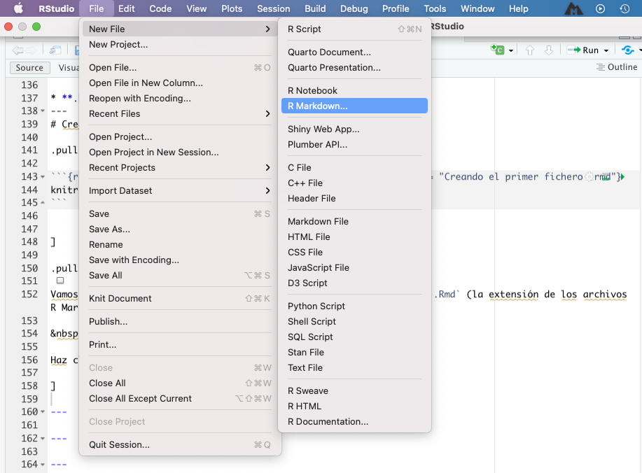
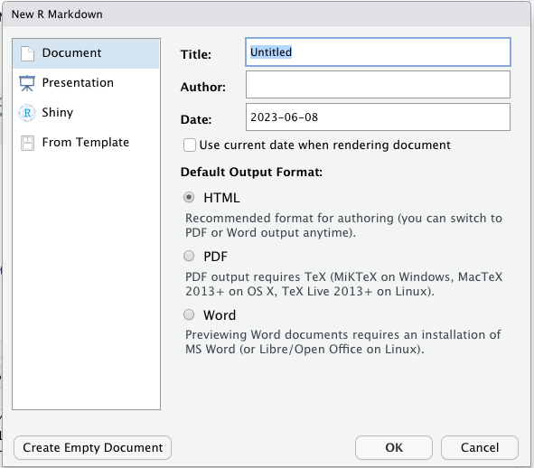
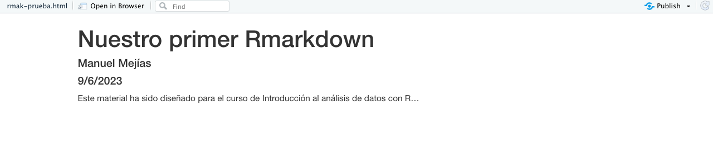
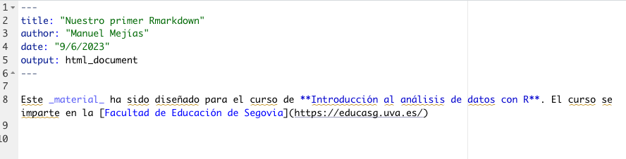
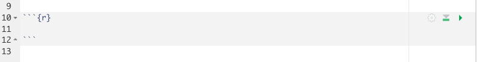
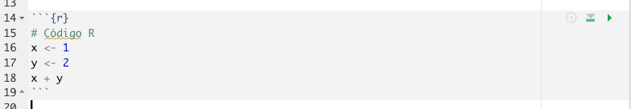
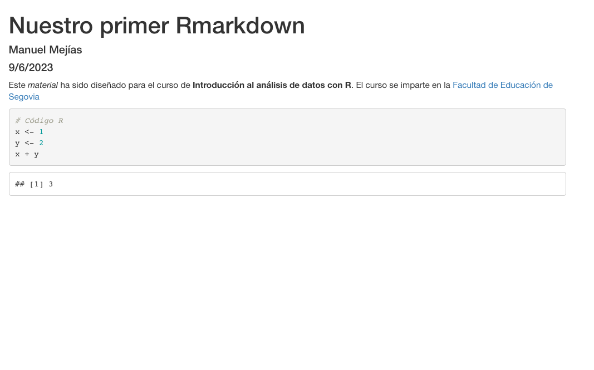

```{r xaringan-themer, include = FALSE}
library(xaringanthemer)
library(emo)
library(fontawesome)

style_duo_accent(primary_color = "#1F4257",
  secondary_color = "#EA9D8E", # #F97B64",
  background_color = "#FFFEFE",
  header_font_google = google_font("Josefin Sans"),
  text_font_google = google_font("Montserrat", "300", "300i", 
                                 "400", "500", "600", 
                                 "700", "800", "900"),
  code_font_google = google_font("Fira Mono"),
  black = "#1F4257",
  inverse_text_color = "#1F4257",
  inverse_header_color = "#1F4257",
  base_font_size = "21px",
  text_font_size = "1rem",
  code_font_size = "0.7rem",
  header_h1_font_size = "2rem",
  header_h2_font_size = "1.8rem",
  header_h3_font_size = "1.6rem",
  code_highlight_color = "rgba(248, 223, 88, 0.25)",
  code_inline_background_color = "rgba(248, 223, 88, 0.6)",
  code_inline_font_size = "1em",
  text_bold_font_weight = 800,
  link_decoration = "underline dotted",
  link_color = "#74688D",
  inverse_link_color = "#1F4257",
  colors = c(purple = "#74688D",
             yellow = "#F8DF58",
             green = "#2c8475",
             red = "#E54F4D",
             orange = "#EA9D8E",
             green_light = "rgba(44, 132, 117, 0.35)",
             red_light = "rgba(229, 79, 77, 0.7)",
             purple_light = "rgba(116, 104, 141, 0.5)"),
  extra_css = list(
    ".title-slide h1" = list(
      "font-size" = "52px",
      "line-height" = "1.1em"),
    ".title-slide h2" = list(
    "margin-top" = "-10px",
    "margin-bottom" = "40px"),
    ".heading h1" = list(
      "line-height" = "1.3em"
    ),
    ".title-slide h3" = list(
    "margin-top" = "40px.",
    "line-height" = "0.3em"),
    ".remark-slide-content" = list(
      "line-height" = "1.1em"),
    ".hljs-github .hljs" = list(
    "background" ="#grey40" ),
    ".inverse a" = list(
      "color"= "white !important"
    ),
    ".table.dataTable.display tbody tr.even" = list(
  "background-color" = "#grey40"),
  ".remark-slide thead, .remark-slide tfoot, .remark-slide tr:nth-child(even)" = list("background" = "#FFFFFF")
    )
  )
```

```{r setup, include=FALSE}
options(htmltools.dir.version = FALSE)
```

class: inverse, center, middle, heading
# Comunicando resultados con Rmarkdown
---

# .orange[COMUNICANDO] resultados: archivos .green[.Rmd] 


Una de las principales **.bg-purple_light[fortalezas]** de `R` es la facilidad para generar informes, libros, webs, **.bg-purple_light[apuntes y hasta diapositivas]** (este material por ejemplo).

&nbsp;

Para ello instalaremos antes el paquete `{rmarkdown}` que nos permitirá generar documentos `.Rmd`

```{r eval = FALSE}
install.packages("rmarkdown")
```

---
# .orange[COMUNICANDO] resultados: archivos .green[.Rmd] 

쮺uál son las **ventajas** de generarlos desde **.bg-purple_light[rmarkdown]**?


* Al hacerlo desde `RStudio`, puedes generar un informe o una presentación **.bg-purple_light[sin salirte del entorno]** de programación en el que estás trabajando


* Podrás analizar los datos, resumirlos y a la vez **.bg-purple_light[comunicarlos]**. 


* Permite **.bg-purple_light[integrar fácilmente código]** `R`, de forma que no solo podremos integrar las salidas de nuestro trabajo sino también el código con el que lo hemos generado.
---
# 쯈ué es .orange[RMARKDOWN]? 

Una herramienta que nos permite crear de forma sencilla **documentos combinando**:


* **.bg-purple_light[Markdown]**: creado en 2004 por John Gruber, y de uso libre, es un «lenguaje» que nos permite crear contenido de una manera sencilla de escribir, y que en todo momento mantenga un diseño legible, con algunas de las ventajas de un HTML (si acostumbras a escribir en wordpress o blogs, seguramente hayas escrito de esta forma).


* **.bg-green_light[Matemáticas (latex)]**: herramienta (lenguaje en realidad) para escribir notación matemática como $x^2$ o $\sqrt{2}$ (si escribes notación similar en editores de texto, seguramente sin saberlo estés usando ya latex).


* **.bg-purple_light[Código]** y salidas de `R`: podremos no solo mostrar el paso final sino el código que has ido realizando, con **cajitas de código** como las del manual.


* **.bg-green_light[Imágenes y tablas]**.


* **.bg-purple_light[Estilos]** (css, js, etc).
---
# Creando nuestro .orange[PRIMER INFORME] 


.pull-left[

```{r echo = FALSE,  out.width = "110%", fig.align = "left", fig.cap = "Creando el primer fichero .rmd"}

``` 


]


.pull-right[

Vamos a crear el **.bg-purple_light[primer fichero]** con extensión `.Rmd` (la extensión de los archivos R Markdown).

&nbsp;

Haz click en el botón `File << New File << R Markdown`.

]

---
# Creando nuestro .orange[PRIMER INFORME] 

.pull-left[

```{r echo = FALSE,  out.width = "100%", fig.align = "left", fig.cap = "Creando el primer fichero .rmd"}

``` 


]

.pull-right[

Tras hacerlo, nos aparecerán **.bg-purple_light[varias opciones]**de formatos de salida:

* archivo `.pdf`

* archivo `.html` (**.bg-purple_light[recomendable]**): documento dinámico, permite la interacción con el usuario, como una «página web»)

* archivo `.doc` (nada recomendable)

De momento dejaremos marcado el **.bg-purple_light[formato HTML que viene por defecto]**, y escribiremos el título de nuestro documento. Tras ello tendremos nuestro archivo `.Rmd` (ya no es un script `.R` como los que hemos abierto hasta ahora)

]
---

# Creando nuestro .orange[PRIMER INFORME] 

Un fichero `.Rmd` se divide básicamente en **.bg-purple_light[tres partes]**

1. **.bg-purple_light[Cabecera]**: la parte que tienes al inicio entre `---`.

2.  **.bg-purple_light[Texto]**: que podremos formatear y mejorar con **negritas** (escrito como `**negritas**`, con doble astérisco al inicio y final), _cursivas_ (`_cursivas_`, con barra baja al inicio y final) o destacar nombres de funciones o variables de `R` (con ``R`). Recuerda que puedes añadir además ecuaciones como $x^2$ (he escrito `$x^2$`, la ecuación entre dólares).
3. **.bg-purple_light[Código R]**.
---

# .orange[PRIMER INFORME]: .green[CABECERA]
La cabecera están en formato `YAML`, y contiene los **.bg-purple_light[metadatos del documento]**: título, autor, fecha, estilos (si los tuviésemos), etc. Para probar, vamos a cambiar la cabecera que nos ha generado por defecto de la siguiente forma:
```{r eval = FALSE}
---
title: "Nuestro primer Rmarkdown"
author: "Manuel Mejías"
date: "9/6/2023"
output: html_document
---
```

---
# .orange[PRIMER INFORME]: .green[TEXTO]

Solo hay una cosa **.bg-purple_light[importante]** a tener en cuenta en este entorno: salvo que indiquemos lo contrario, **.bg-purple_light[TODO lo que vamos a escribir en el documento es texto]**. No código R. Texto plano que podremos mejorar un poco con algun detalle, pero texto.

Vamos a empezar nuestro documento escribiendo por ejemplo la siguiente frase


```{r eval = FALSE}
Este material ha sido diseñado para el curso de Introducción al análisis de datos con R...
```

---
# .orange[PRIMER INFORME]: .green[TEXTO]


.pull-left[

```{r echo = FALSE,  out.width = "120%", fig.align = "left", fig.cap = "Primer informe html"}

``` 

]

.pull-right[

Una vez que hemos escrito el texto vamos a **.bg-purple_light[guardar el archivo .Rmd]** haciendo click en el botón `Guardar` (yo he llamado al archivo `primer_rmarkdown.Rmd`). Tras guardar el documento, **.bg-purple_light[«tejeremos» nuestro documento]** haciendo click en el botón `Knit`.

Al «tejer» se nos habrá generado (seguramente en una ventana al margen) un archivo .html, que podemos incluso **.bg-purple_light[abrir en nuestro navegador]**. Hemos creado nuestro primer informe, obviamente vacío de momento. 


]

---
# .orange[PRIMER INFORME]: .green[TEXTO]


.pull-left[

```{r echo = FALSE,  out.width = "140%", fig.align = "left", fig.cap = "Tuneando nuestro primer informe html"}

``` 

]

.pull-right[

Vamos a **.bg-purple_light[mejorar]** un poco el texto haciendo lo siguiente:

* Vamos a añadir **.bg-purple_light[negrita]** al nombre (poniendo `**` al inicio y al final).

* Vamos añadir _cursiva_ a la palabra `material` (poniendo `_` al inicio y al final).

*  Vamos añadir un enlace `https://educasg.uva.es/`, asociándolo al nombre de la Universidad. Para ello el título lo ponemos entre corchetes y justo detrás el enlace entre paréntesis `[«Facultad de Educación de Segovia»](https://educasg.uva.es/)`

]
---
# .orange[PRIMER INFORME]: .green[CHUNKS] de R

Para añadir **.bg-purple_light[código R]** debemos crear nuestras **.bg-purple_light[cajas de código]** llamadas **.bg-orange[chunks]**: altos en el camino en nuestro texto markdown donde podremos incluir **código**. Para incluir uno deberá de ir encabezado de la siguiente forma.

```{r echo = FALSE,  out.width = "90%", fig.align = "left", fig.cap = "Encabezado/final del chunk"}

``` 
---
# .orange[PRIMER INFORME]: .green[CHUNKS] de R


Dentro de dicha **.bg-purple_light[cajita]** (que tiene ahora **otro color** en el documento) escribiremos **.bg-purple_light[código R]**, como lo veníamos haciendo hasta ahora. Vamos por ejemplo a **.bg-purple_light[definir dos variables]** y su suma de la siguiente manera, escribiendo dicho código en nuestro `.Rmd` (dentro de ese chunk)

.pull-left[

```{r}
# Código R
x <- 1
y <- 2
x + y
```

]

.pull-right[

```{r echo = FALSE,  out.width = "130%", fig.align = "left", fig.cap = "Primer chunk con código"}

``` 

]
---
# .orange[PRIMER INFORME]: .green[CHUNKS] de R

Como ves dentro de esos _chunks_ puedes **.bg-purple_light[comentar código]** con `#` (ahora veremos que hace `#` fuera de esas cajas de código). Tras hacerlo tejemos de nuevo y obtenemos ahora un documento que tiene una caja de código y su salida.

```{r echo = FALSE,  out.width = "90%", fig.align = "center", fig.cap = "Salida del html con el primer chunk"}

``` 
---
# .orange[PRIMER INFORME]: .green[ORGANIZANDO]

Con todo incluido en el documento podemos **.bg-purple_light[dividirlo en secciones y subsecciones]**. Para ello usaremos la sintaxis de markdown, poniendo **.bg-purple_light[almohadillas]**: una `#` para secciones, `##` para subsecciones, `###` para subsubsecciones, etc. Por ejemplo, vamos a

* Hacer una sección principal que sea `# Primer informe`
* Tras ello añadiremos la parte de texto.
* Creamos una subsección que se titule `## Chunks de código` donde incluiremos los dos chunks que tenemos hasta ahora.

Además podemos incluir tras el título (y entre llaves `{}`) **.bg-purple_light[etiquetas]** (con `{#etiqueta}`) para luego **.bg-purple_light[referenciar dichas secciones]** en el documento.

También podemos organizar nuestro código **.bg-purple_light[creando listas]**, usando `*` como ítems.
---
# .orange[PRIMER INFORME]: .green[PERSONALIZAR]

En cada chunk aparece una **.bg-purple_light[botón de play]**: pulsándolo podemos tener la **ejecución y salida** de cada chunk en nuestro `.Rmd`, sin tener que esperar a «tejer» (con Knit) todo el documento para ver lo que vamos ejecutando.

Además podemos **.bg-purple_light[incluir código R dentro de la línea de texto]** (en lugar de mostrar el texto x ejecuta el código R mostrando la variable).
---
# .orange[PRIMER INFORME]: .green[PERSONALIZAR]


Los chunk podemos **.bg-purple_light[personalizar su salida]** con algunas opciones, pasándolos como argumentos dentro de las llaves ({r etiqueta, ...}).

* `include = FALSE`: **.bg-green_light[ejecuta código]** pero **.bg-red_light[no se muestra (ni resultados)]** en la salida.

* `echo = FALSE`: **.bg-green_light[ejecuta código]** y se **.bg-green_light[muestra resultado]** pero **.bg-red_light[no el código]** en la salida.

* `eval = FALSE`: se **.bg-green_light[muestra el código]** pero **.bg-red_light[no se ejecuta]** en la salida final.

* `message = FALSE`: se **.bg-green_light[ejecuta el código]** pero **.bg-red_light[no se muestran mensajes]** de salida que tendríamos en consola.

* `warning = FALSE`: **.bg-green_light[ejecuta código]** pero **.bg-red_light[no se muestran warning]**.

* `error = TRUE`: se **.bg-green_light[ejecuta el código]** pero permite ejecutar el código **.bg-green_light[con errores]** mostrando los mensajes de error.


Estas opciones podemos aplicarlas chunk a chunk o fijar los parámetros de forma global con `knitr::opts_chunk$set()` (dentro de un chunk), pasándole como argumentos dichas opciones (por ejemplo, `knitr::opts_chunk$set(echo = FALSE)`).

---
class: inverse, center, middle, heading

# Ejercicio final de repaso 📝

---
# Enunciado
El objetivo de este ejercicio es investigar si **las circunstancias socioeconómicas durante la infancia de los adultos encuestados tienen influencia en la obtención de estudios universitarios en la edad adulta**. Para tratar de dar respuesta a este objetivo general, utilizaremos la base de datos de la *Encuesta de Condiciones de Vida (ECV)* del año 2019, llevada a cabo por el Instituto Nacional de Estadística (INE).

En este ejercicio abordaremos la gran parte de los temas tratados a lo largo del curso, que incluyen la importación de datos, la limpieza de los mismos, el análisis exploratorio, la visualización y la modelización mediante modelos de regresión.

Se trabajaran con las siguientes variables de la ECV (entre paréntesis se muestran los nombres con los que aparecen en la hoja del cuestionario):

- **.bg-purple_light[Nivel educativo terminado por el encuestado/a]** (PE040)
- **.bg-purple_light[Género]** (RB090)
- **.bg-purple_light[Edad]** (RB080)
- **.bg-purple_light[Situación económica del hogar cuando el adulto era adolescente]** (PT190)


   **.orange[IMPORTANTE]**: abre el cuestionario para tener presente las características de las variables incluidas en la base de datos.

```{r echo=FALSE, eval=FALSE}
ecv19 <- read_csv("ecv19.csv") %>%
  select(c(sexo,edad,nivel_educativo,situacion_economica_infancia)) %>%
  transmute(
    RB080 = case_when(
      sexo == "Hombre" ~ 1,
      sexo == "Mujer" ~ 2),
    RB090 = edad,
    PE040 = nivel_educativo,
    PT190 = case_when(
      situacion_economica_infancia == "Muy mala" ~ 1,
      situacion_economica_infancia == "Mala" ~ 2,
      situacion_economica_infancia == "Moderadamente mala" ~ 3,
      situacion_economica_infancia == "Moderadamente buena" ~ 4,
      situacion_economica_infancia == "Buena" ~ 5,
      situacion_economica_infancia == "Muy buena" ~ 6))

write_csv(ecv19, "ecv19.csv")
```

---
# 📝 **Apartado 1**: 
A continuación se realizarán los siguientes pasos:

- Carga las librerías necesarias para el análisis: `tidyverse`, `sjPlot` y `ggeffects.`

- Define el directorio de trabajo.

- Importa los datos.

- Realiza un primer análisis exploratorio: describe la naturaleza de las variables y muestra las filas y columnas de la base de datos con `glimpse`. Escribe en el script usando `#` el tipo de variables (numérica, factor, character, etc), el número de columnas y el número de filas que tiene la base de datos.

- Utiliza la función `summary` para obtener un resumen estadístico inicial de las variables. Por ejemplo, escribe el número de valores perdidos (NA) que tiene la variable de situación económica del hogar durante la infancia.


---
# 📝 **Apartado 2**: 
En este apartado se llevarán a cabo las siguientes tareas de limpieza de datos:

- Filtra los datos por edad, considerando únicamente a los encuestados de entre 25 y 59 años. Realiza este paso con la función `filter`.

- Elimina todos los valores perdidos de la base de datos con la función `drop_na`. En este ejercicio se trabajará únicamente con los casos completos en todas las variables.

- Usar la función `mutate` o `transmute` (esta última opción es más cómoda) para limpiar las variables:
  - Crea una nueva variable llamada **"uni"** que tenga el valor 1 para aquellos encuestados que han conseguido estudios universitarios y el valor 0 para el resto de encuestados que han conseguido estudios menores a los universitarios.
  - Añade etiquetas a la variable "género" (1 = hombre; 2 = mujer).
  - Recodifica la variable "edad" en los siguientes grupos: 25-29; 30-34; 35-39; 40-44; 45-52.
  - Añade las categorías a la variable "situación económica durante la infancia" (mala, muy mala, moderadamente mala, etc).


   **.orange[CONSEJO]**: sería útil usar `if_else` o `case_when` para recodificar las variables.
---
# 📝 **Apartado 3**: 

En este apartado se pide crear un gráfico de columnas que muestre en el eje X la variable "situación económica durante la infancia" y en el eje Y el porcentaje de encuestados con educación universitaria. Para ello, se calculará previamente el porcentaje de encuestados con educación universitaria según la situación económica del hogar durante su infancia y se asignará a un nuevo objeto llamado **"dfplot"**.

Para crear el gráfico de columnas que muestra el porcentaje de encuestados con educación universitaria según la situación económica del hogar durante su infancia, se puede seguir el siguiente trozo de código:

```{r eval=FALSE, echo=TRUE}
dfplot <- datos %>% #Añade a un nuevo objeto la nueva base de datos que vas a crear
  drop_na(variable1, variable2) %>% # Elimina valores perdidos
  group_by(variable1, variable2) %>% # Agrupa por las variables
  summarise(n = n()) %>% # Calcula el número de casos en cada combinación de variables
  mutate(porcentaje = (n / sum(n)) * 100) # Calcula el porcentaje y crea una nueva variable


# Completa el siguiente trozo de código para crear el gráfico de columnas
___ %>%
  filter() %>% #quédate solo con aquellos/as que tienen estudios universitarios
  ggplot(aes(x = ___, y = ___)) +
  geom_?() +
  labs()
```

---
# 📝 **Apartado 4**: 

En este apartado, se procederá a crear un modelo de regresión logística para analizar la asociación de las variables socioeconómicas con el logro de estudios universitarios por parte de los encuestados. Se considerará la **variable dependiente "uni"**, que toma el valor 1 si el encuestado ha conseguido estudios universitarios y 0 en caso contrario. Las **variables independientes** clave serán la **situación económica durante la infancia, la edad y el género**.

A continuación, se detallan los pasos a seguir:

- Crea un modelo de regresión logística. VD = uni ~ VI = resto de variables. La función necesaria para modelizar una regresión logística en R es `glm()`.

- Modifica las categorías de referencia de las variables si consideras conveniente. Esto puedes hacerlo con `relevel.`

- Muestra los resultados del modelo e interprétalos (puedes servirte de la función `report`). CUIDADO! Antes tienes que cargar la librería `report`.

- Calcula las probabilidades predichas para la variable situación económica del hogar (puedes usar `plot_model` o `ggeffects`). Por último, interpreta el gráfico que se genera.